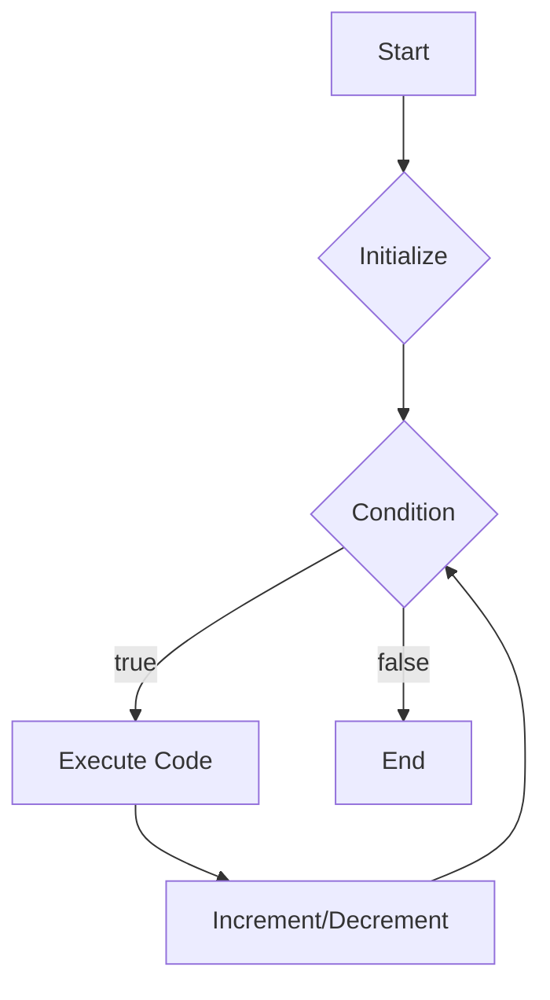
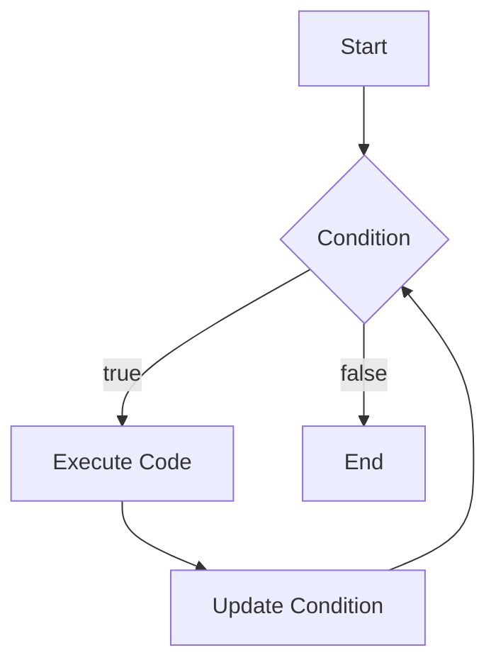

# 🌟 Session 5: JavaScript Loops: Repeat After Me! 🔄

Welcome back, young coders! Today, we’re going to dive into the world of loops in JavaScript. Loops allow you to repeat actions in your code, which can make it more efficient and powerful. Ready to learn how to count from 1 to 10 and display the numbers on your webpage? Let’s get started!

## 🎯 **Learning Goals for Today**

By the end of this session, you will:
1. Understand what loops are and why they are useful.
2. Learn about `for` loops and `while` loops in JavaScript.
3. Create a script that counts from 1 to 10 and displays the numbers on the webpage.

## 📖 **Introduction to JavaScript Loops**

### **What are Loops?**

Loops are programming constructs that repeat a block of code as long as a specified condition is true. They help reduce redundancy and make code more efficient. Instead of writing the same code multiple times, you can use loops to repeat actions.

### **Key Concepts of Loops**

- **For Loop**: Repeats a block of code a certain number of times.
- **While Loop**: Repeats a block of code as long as a condition is true.

## 🔍 **Exploring JavaScript Loops**

### **For Loops**

- **Explanation**: A `for` loop repeats a block of code a specific number of times. It consists of three parts: initialization, condition, and increment/decrement.
- **Example**:

  ```javascript
  for (let i = 1; i <= 10; i++) {
      console.log(i);
  }
  ```

### **While Loops**

- **Explanation**: A `while` loop repeats a block of code as long as a condition is true. Be careful to update the condition within the loop to avoid infinite loops.
- **Example**:

  ```javascript
  let i = 1;
  while (i <= 10) {
      console.log(i);
      i++;
  }
  ```

## 💻 **Interactive Coding Activity: Counting from 1 to 10**

### **1. Set Up Your Coding Environment**

1. Open your favorite code editor.
2. Create a new HTML file named `count.html`.


### **1. For Loop Diagram**



### **2. While Loop Diagram**



These diagrams provide a visual representation of how `for` and `while` loops work in JavaScript.

### **2. Write Your Loop Code**

Follow these steps to create a script that counts from 1 to 10 and displays the numbers on your webpage:

1. **Step 1: Create the Basic HTML Structure**

    ```html
    <!DOCTYPE html>
    <html lang="en">
    <head>
        <meta charset="UTF-8">
        <meta name="viewport" content="width=device-width, initial-scale=1.0">
        <title>Counting from 1 to 10</title>
    </head>
    <body>
        <h1>Counting from 1 to 10</h1>
        <p id="countDisplay"></p>

        <script src="count.js"></script>
    </body>
    </html>
    ```

2. **Step 2: Create the JavaScript File**

    Create a file named `count.js` and add the following code:

    ```javascript
    let countDisplay = document.getElementById('countDisplay');

    for (let i = 1; i <= 10; i++) {
        countDisplay.innerHTML += i + "<br>";
    }
    ```

3. **Save and Open Your File**:

    - Save both `count.html` and `count.js`.
    - Open `count.html` in your web browser to see the numbers 1 to 10 displayed.

### **3. Experiment with Your Own Content**

Try using a `while` loop instead of a `for` loop to achieve the same result.

- **Challenge**: Use a `while` loop to count down from 10 to 1 and display the numbers on your webpage.

## 📚 **Interactive Quiz**

Let’s test your knowledge with a fun quiz! Answer the following questions to see how much you’ve learned.

1. **What does a `for` loop do?**
    - a) Repeats a block of code a specific number of times.
    - b) Repeats a block of code as long as a condition is true.
    - c) Runs code only once.

2. **What are the three parts of a `for` loop?**
    - a) Condition, initialization, and increment/decrement.
    - b) Condition, loop body, and increment/decrement.
    - c) Initialization, condition, and increment/decrement.

3. **What is the key difference between `for` and `while` loops?**
    - a) `For` loops repeat code a specific number of times; `while` loops repeat code as long as a condition is true.
    - b) `While` loops repeat code a specific number of times; `for` loops repeat code as long as a condition is true.
    - c) `For` loops always run faster than `while` loops.

### **Quiz Answers:**

1. a) Repeats a block of code a specific number of times.
2. c) Initialization, condition, and increment/decrement.
3. a) `For` loops repeat code a specific number of times; `while` loops repeat code as long as a condition is true.

## 🛠️ **Hands-On Project: Number Counting Script**

In this project, you’ll create a more complex script that counts numbers in different ways using the skills you’ve learned today.

### **Project Steps:**

1. **Create a NEW HTML File:** Name it `number_counting.html`.
2. **Add Your Basic HTML Structure:**

    ```html
    <!DOCTYPE html>
    <html lang="en">
    <head>
        <meta charset="UTF-8">
        <meta name="viewport" content="width=device-width, initial-scale=1.0">
        <title>Number Counting</title>
    </head>
    <body>
        <h1>Number Counting</h1>
        <p id="countUp"></p>
        <p id="countDown"></p>
        <p id="evenNumbers"></p>
        <p id="oddNumbers"></p>

        <script src="number_counting.js"></script>
    </body>
    </html>
    ```

3. **Create the JavaScript File:**

    Create a file named `number_counting.js` and add the following code:

    ```javascript
    // Count up from 1 to 10
    let countUp = document.getElementById('countUp');
    for (let i = 1; i <= 10; i++) {
        countUp.innerHTML += i + " ";
    }

    // Count down from 10 to 1
    let countDown = document.getElementById('countDown');
    for (let i = 10; i >= 1; i--) {
        countDown.innerHTML += i + " ";
    }

    // Display even numbers from 1 to 10
    let evenNumbers = document.getElementById('evenNumbers');
    for (let i = 2; i <= 10; i += 2) {
        evenNumbers.innerHTML += i + " ";
    }

    // Display odd numbers from 1 to 10
    let oddNumbers = document.getElementById('oddNumbers');
    for (let i = 1; i <= 10; i += 2) {
        oddNumbers.innerHTML += i + " ";
    }
    ```

4. **Save and Preview:**

    - Save both `number_counting.html` and `number_counting.js`.
    - Open `number_counting.html` in your web browser to see the results.

## ✨ **Wrap-Up and Homework**

You did an amazing job today! To reinforce what you've learned:

- **Homework:** Create a script that displays the multiplication table for a given number using a loop.
- **Additional Practice:** Experiment with nested loops by creating patterns with numbers or characters on your webpage.

## 🚀 **Fun Fact!**

Did you know that loops are used in almost every programming language to perform repetitive tasks? By learning how to use loops, you are mastering a fundamental concept in programming! Now, you’re part of the awesome world of web development!
