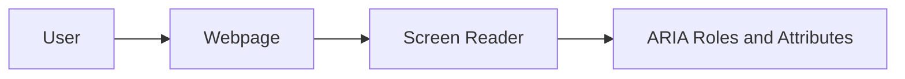
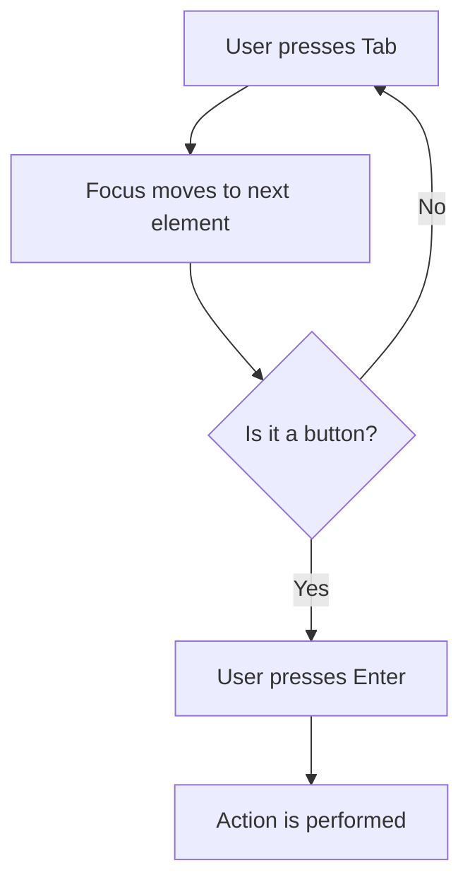

# 1. JavaScript: The Web's Magician! (30 minutes)

## Introduction to Accessibility

In this session, we'll learn how JavaScript can help make websites easy to use for people with disabilities. This is called "web accessibility."

### Why Accessibility Matters
Web accessibility is about making sure everyone can use websites, regardless of their abilities. This includes people who are blind, have low vision, are deaf or hard of hearing, or have other disabilities.

### Key Concepts
- **ARIA (Accessible Rich Internet Applications):** ARIA defines ways to make web content and web applications more accessible to people with disabilities.
- **Keyboard Navigation:** Ensuring all functionality is available using a keyboard.

## How JavaScript Helps with Accessibility

### 1. Using ARIA Roles
ARIA roles help assistive technologies understand the purpose of elements on your webpage.

```html
<button role="button" aria-label="Submit Form">Submit</button>
```

### 2. Keyboard Navigation
Make sure users can navigate your site using only a keyboard.

```javascript
document.addEventListener('keydown', function(event) {
    if (event.key === 'Enter') {
        // Perform action
    }
});
```

### 3. Dynamic Content Updates
Ensure that changes on your webpage are announced to assistive technologies.

```javascript
let liveRegion = document.getElementById('live-region');
liveRegion.setAttribute('aria-live', 'polite');
liveRegion.textContent = 'Content updated!';
```

## Practical Examples

### Example 1: Accessible Modal
Let's create a simple modal that is accessible.

#### HTML
```html
<button id="open-modal" aria-haspopup="dialog">Open Modal</button>

<div id="modal" role="dialog" aria-labelledby="modal-title" aria-hidden="true">
    <h2 id="modal-title">Modal Title</h2>
    <p>This is a simple modal.</p>
    <button id="close-modal">Close</button>
</div>
```

#### CSS
```css
#modal {
    display: none;
    /* Add more styling here */
}
```

#### JavaScript
```javascript
let openModalButton = document.getElementById('open-modal');
let closeModalButton = document.getElementById('close-modal');
let modal = document.getElementById('modal');

openModalButton.addEventListener('click', function() {
    modal.style.display = 'block';
    modal.setAttribute('aria-hidden', 'false');
    closeModalButton.focus();
});

closeModalButton.addEventListener('click', function() {
    modal.style.display = 'none';
    modal.setAttribute('aria-hidden', 'true');
    openModalButton.focus();
});
```

### Example 2: Accessible Form Validation
Provide instant feedback for form validation.

#### HTML
```html
<form id="signup-form">
    <label for="email">Email: </label>
    <input type="email" id="email" aria-describedby="email-error" required>
    <span id="email-error" role="alert"></span>
    <button type="submit">Sign Up</button>
</form>
```

#### JavaScript
```javascript
let signupForm = document.getElementById('signup-form');
let emailInput = document.getElementById('email');
let emailError = document.getElementById('email-error');

signupForm.addEventListener('submit', function(event) {
    if (!emailInput.validity.valid) {
        emailError.textContent = 'Please enter a valid email.';
        emailInput.setAttribute('aria-invalid', 'true');
        event.preventDefault();
    } else {
        emailError.textContent = '';
        emailInput.setAttribute('aria-invalid', 'false');
    }
});
```

## Visual Aids

### Diagram: How ARIA Works



### Diagram: Keyboard Navigation Flow



## Additional Resources
- [WebAIM - Introduction to Web Accessibility](https://webaim.org/intro/)
- [MDN Web Docs - ARIA](https://developer.mozilla.org/en-US/docs/Web/Accessibility/ARIA)
- [W3C Web Accessibility Initiative](https://www.w3.org/WAI/)

---

By the end of this session, you should have a basic understanding of how JavaScript can enhance the accessibility of your websites. Remember, making your website accessible helps everyone!